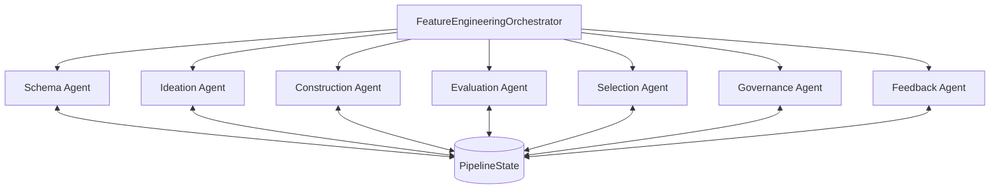
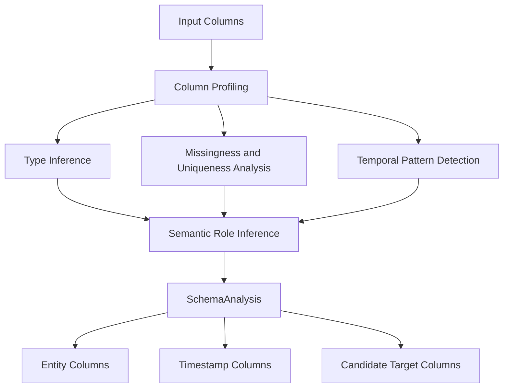
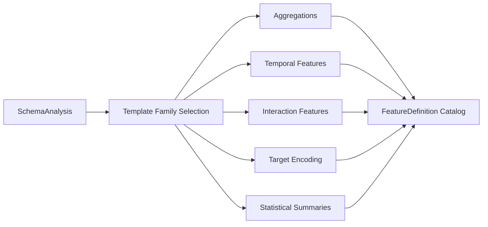
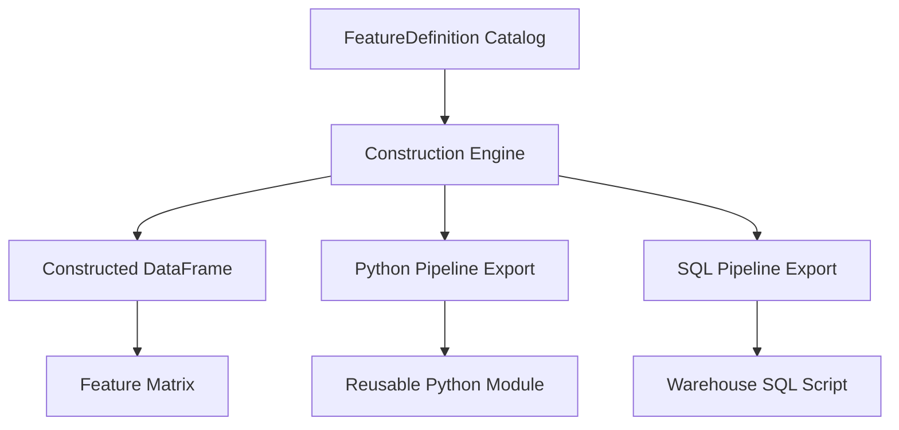
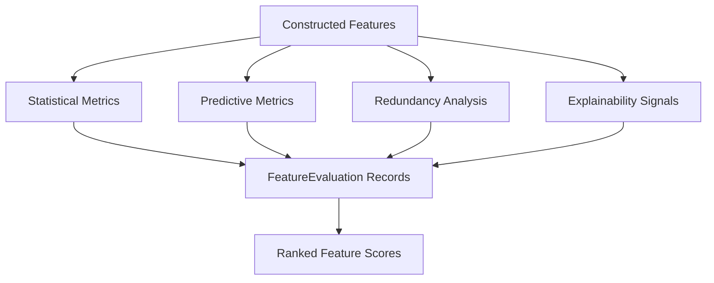
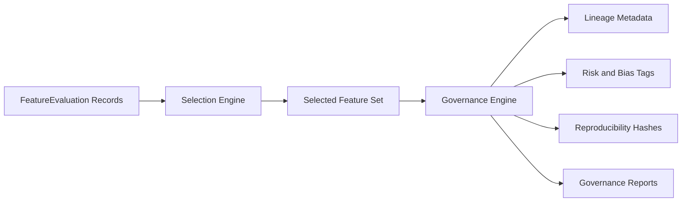
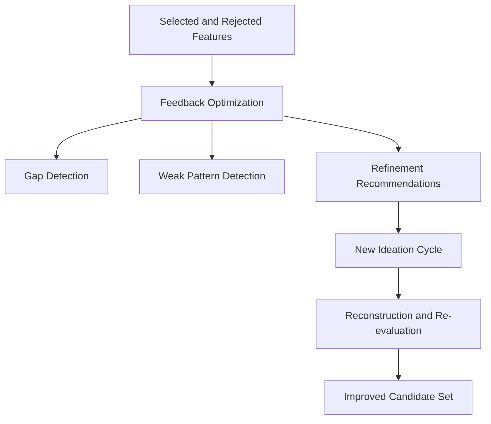
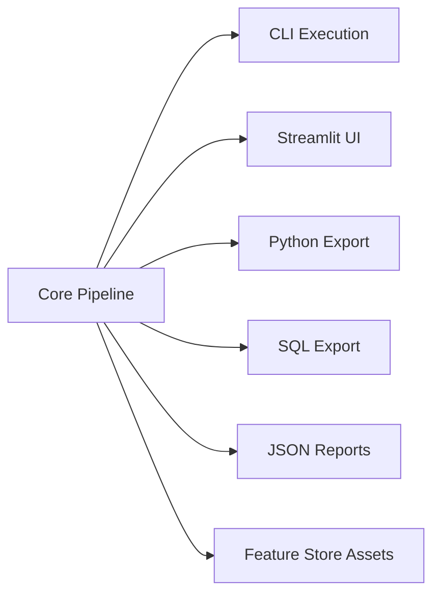

# Multi-Agent Feature Engineering System

Core Invention Disclosure and Technical Specification for Patent Preparation

## Proprietary and Patent Notice

This repository contains proprietary technical subject matter owned exclusively by Yang (Rick) Wang, Ph.D., the repository author/inventor, and is not released as open source.

For authorship, ownership, and invention attribution purposes throughout this repository, the owner/inventor is Yang (Rick) Wang, Ph.D.

The system design, orchestration logic, feature generation methodology, evaluation framework, governance workflow, generated code patterns, and related implementation details described in this repository are the intellectual property of Yang (Rick) Wang, Ph.D. Certain aspects of this solution are the subject of one or more patent applications already filed by Yang (Rick) Wang, Ph.D. as owner/inventor. Unless and until explicitly stated otherwise in a separate written agreement, the material in this repository must be treated as patent pending, proprietary, and confidential.

No license, assignment, waiver, or other transfer of rights is granted by possession of this repository, by reading this documentation, or by using generated outputs. No party may reproduce, distribute, commercialize, reverse engineer, create derivative commercial implementations from, or use this material for model-training or productization purposes without prior written authorization from Yang (Rick) Wang, Ph.D. as owner/inventor. Publication of this repository is not intended to dedicate any invention, claim, algorithm, workflow, trade secret, copyright, or other protectable subject matter to the public.

If this repository is ever circulated outside the controlled environment of Yang (Rick) Wang, Ph.D., the patent notice, owner name, legal entity name, and any application-reference wording should be aligned with final counsel-approved language.

## Patent Preparation Use of This README

This README is intentionally written to function as the core technical disclosure record supporting patent preparation for Yang (Rick) Wang, Ph.D. It is structured to help patent counsel, patent agents, and prosecution teams derive a formal filing package by capturing the invention title, technical field, background, technical problems solved, inventive concepts, architecture, representative embodiments, implementation details, alternatives, operational advantages, and reduction-to-practice evidence.

This document should therefore be treated as the primary invention narrative and technical reference for patent drafting. It is not, by itself, the complete filing packet for a nonprovisional application. A formal filing package should still be assembled in counsel-controlled form with claims, abstract, drawings when necessary, application data, inventor oath or declaration, and filing-form compliance.

## Invention Record Metadata

| Field | Value |
| --- | --- |
| Invention title | Multi-Agent Feature Engineering System for Automated, Governed, and Exportable Feature Synthesis |
| Inventor / owner | Yang (Rick) Wang, Ph.D. |
| Document role | Core invention disclosure and technical specification supporting patent preparation |
| Technical domains | Machine learning, automated feature engineering, data transformation systems, model-governance infrastructure |
| Implementation status | Reduced to practice through working software implementation contained in this repository |
| Filing posture | One or more patent applications have already been filed; specific application identifiers should be inserted only in counsel-controlled versions |
| Intended use of this README | Source document for drafting provisional, nonprovisional, continuation, foreign counterpart, diligence, or licensing-support materials |

## Technical Field

This invention relates generally to computer-implemented machine learning infrastructure and, more specifically, to systems and methods for automated feature engineering over tabular datasets. The invention further relates to schema-aware feature synthesis, executable transformation generation, model-informed feature evaluation, governance-aware feature selection, and iterative optimization workflows for deployable analytics pipelines.

## Background and Technical Problems

Conventional feature engineering is typically fragmented across notebooks, data-preparation scripts, feature-store tooling, analyst intuition, and ad hoc experimentation. That conventional workflow creates several technical weaknesses:

- candidate features are generated manually and at low scale
- semantic meaning is often lost between idea generation and implementation
- executable code for features is inconsistently translated across Python and SQL environments
- leakage and temporal-validity risks are easy to introduce and difficult to audit
- evaluation often depends on one metric rather than a multi-signal quality framework
- governance, lineage, reproducibility, and bias checks are treated as afterthoughts
- iteration is slow because rejected features are rarely transformed into structured learning for the next design round

The present system addresses these shortcomings by coordinating multiple specialized agents around a common typed state model and by converting feature ideas into traceable, evaluable, governable, and exportable artifacts.

## Distinguishing Inventive Concepts

The inventive contribution is not merely "automating feature engineering" in the abstract. The stronger technical contribution described by this repository is the coordinated combination of:

- a multi-agent orchestration architecture in which specialized agents are responsible for schema analysis, ideation, construction, evaluation, selection, governance, and feedback optimization
- a shared typed pipeline state that carries semantic and evidentiary information across the full lifecycle of feature generation
- schema-aware feature ideation that selects candidate-feature families using inferred semantic roles, entity structure, temporal context, and target availability
- automatic conversion of abstract feature intent into executable pandas logic and exportable SQL expressions
- multi-metric feature evaluation using statistical, predictive, redundancy, and explainability-oriented signals
- governance generation that records lineage, reproducibility identifiers, risk tags, and bias-adjacent indicators for each selected feature
- a closed-loop feedback mechanism that turns evaluation and governance results into subsequent rounds of feature refinement
- deployment-facing export surfaces that transform invention output into reusable Python modules, SQL scripts, JSON reports, and feature-store assets

These concepts can support method claims, system claims, and computer-readable-medium claims when translated by counsel into formal claim language.

## Summary of the Invention

This project implements a production-oriented multi-agent feature engineering platform for tabular machine learning. The system analyzes a raw dataset, infers schema semantics, proposes a large catalog of candidate features, constructs executable feature logic, evaluates each candidate with multiple statistical and model-based signals, selects a compact high-value subset, records governance metadata, and optionally enters a feedback loop for iterative improvement.

The codebase is organized around a central `FeatureEngineeringOrchestrator` that coordinates seven specialized agents:

1. `SchemaUnderstandingAgent`
2. `FeatureIdeationAgent`
3. `FeatureConstructionAgent`
4. `FeatureEvaluationAgent`
5. `FeatureSelectionAgent`
6. `FeatureGovernanceAgent`
7. `FeedbackOptimizationAgent`

The implementation targets real feature-engineering concerns rather than toy feature transforms. It includes temporal leakage protection, time-aware rolling logic, target-encoding safeguards, governance records, reproducibility hashes, Streamlit-based exploration, exportable Python and SQL artifacts, and a synthetic data generator for demo and validation scenarios.

## Problems Addressed by the Invention

The system is designed to solve five hard problems that commonly appear in enterprise feature engineering programs:

- Scale candidate generation beyond a handful of hand-authored transformations.
- Preserve domain meaning by attaching business intuition and mathematical definitions to every candidate feature.
- Translate ideas into executable pandas and SQL logic automatically.
- Rank features using multiple quality lenses instead of a single metric.
- Preserve governance evidence so selected features can be reviewed, reproduced, and audited.

## High-Level Architecture

```text
raw dataframe
  -> schema analysis
  -> feature ideation
  -> feature construction
  -> feature evaluation
  -> feature selection
  -> governance recording
  -> feedback optimization
  -> exported artifacts
```

Primary control flow:

```text
FeatureEngineeringOrchestrator
  |- SchemaUnderstandingAgent
  |- FeatureIdeationAgent
  |- FeatureConstructionAgent
  |- FeatureEvaluationAgent
  |- FeatureSelectionAgent
  |- FeatureGovernanceAgent
  '- FeedbackOptimizationAgent
```

Primary state carrier:

- `PipelineState` in `core/data_models.py` is the single typed contract shared across all agents.
- Each stage enriches the same state object rather than inventing an ad hoc side-channel.
- Large constructed matrices are attached out-of-band via `state.__dict__["constructed_df"]` to avoid bloating serialized state models.

## Candidate Figure Set for Patent Drafting

The following figure set can be derived from this README and the implementation for a counsel-prepared patent application:

- Figure 1: end-to-end block diagram of the multi-agent feature engineering system
- Figure 2: orchestrator control flow showing stage ordering and shared pipeline state
- Figure 3: schema understanding subsystem and semantic-role inference pipeline
- Figure 4: feature ideation engine mapping schema semantics to candidate template families
- Figure 5: feature construction subsystem generating executable Python and SQL artifacts
- Figure 6: evaluation pipeline combining statistical, predictive, redundancy, and explainability signals
- Figure 7: selection and governance pipeline producing selected features, lineage records, and reproducibility metadata
- Figure 8: feedback optimization loop for iterative candidate refinement
- Figure 9: deployment/export architecture for CLI, UI, Python module, SQL script, JSON outputs, and feature-store assets

For formal filing, these figures should be converted into standalone drawing sheets rather than embedded in the nonprovisional specification text.

## Brief Description of Candidate Drawings

- Figure 1 illustrates an end-to-end processing pipeline from raw tabular data to exported feature artifacts.
- Figure 2 illustrates an orchestrator-driven execution flow in which specialized agents operate over a shared pipeline state.
- Figure 3 illustrates schema understanding and semantic-role inference performed on input columns.
- Figure 4 illustrates generation of candidate-feature definitions from schema semantics and template families.
- Figure 5 illustrates construction of executable feature transformations and dual export into Python and SQL representations.
- Figure 6 illustrates evaluation of candidate features using multiple statistical and model-based quality signals.
- Figure 7 illustrates selection, governance, lineage recording, and reproducibility-metadata generation for selected features.
- Figure 8 illustrates a feedback optimization loop in which prior evaluation outcomes guide subsequent ideation or refinement.
- Figure 9 illustrates deployment surfaces including command-line execution, interactive UI review, exported code artifacts, and feature-store materialization.

## Embedded Reference Figures

The figures referenced above are embedded below as Mermaid diagrams for technical review and invention documentation. For formal patent filing, they should be redrawn as standalone patent-compliant figure sheets.

### Figure 1. End-to-End Multi-Agent Feature Engineering System


### Figure 2. Orchestrator Control Flow and Shared Pipeline State



### Figure 3. Schema Understanding and Semantic Role Inference



### Figure 4. Schema-Aware Feature Ideation



### Figure 5. Feature Construction and Dual Export



### Figure 6. Multi-Metric Feature Evaluation



### Figure 7. Selection, Governance, and Reproducibility



### Figure 8. Closed-Loop Feedback Optimization



### Figure 9. Deployment and Review Surfaces



## What the System Produces

A successful pipeline run can produce the following artifact classes:

- Candidate feature catalog with rich metadata.
- Constructed feature matrix for the current dataset.
- Evaluation records per feature.
- Selected-feature subset and rejection reasons.
- Governance records with lineage and reproducibility metadata.
- Python transform module for downstream applications.
- SQL feature script for warehouse execution.
- Run summary JSON and governance JSON reports.
- Optional feature store contents for registry and parquet persistence.

Typical output locations:

- `outputs/run_summary_<run_id>.json`
- `outputs/governance.json`
- `outputs/pipeline.log`
- CLI override via `python main.py run --output <dir>`
- Feature store materialization under `<output_dir>/feature_store/`

## Agent Responsibilities

### 1. Schema Understanding

Implemented in `agents/schema_agent.py`.

Responsibilities:

- Profiles each column.
- Infers semantic roles such as identifier, timestamp, amount, categorical, text, and label.
- Computes missingness, uniqueness, distribution characteristics, and temporal granularity.
- Detects entity columns and target columns when not explicitly supplied.
- Produces `SchemaAnalysis`, which becomes the semantic foundation for all downstream work.

Why it matters:

- The rest of the pipeline is template-driven, so schema quality directly determines feature quality.
- Bad semantic inference creates invalid features, weak evaluation, or leakage risk.

### 2. Feature Ideation

Implemented in `agents/ideation_agent.py`.

Responsibilities:

- Generates a broad candidate library from schema-aware templates.
- Encodes business rationale and mathematical intent for each feature.
- Produces `FeatureDefinition` objects rather than directly mutating the data.

Template families currently represented in code include:

- Temporal and calendar features
- Lag and delta features
- Rolling window aggregations
- Recency and freshness features
- Behavioral and RFM features
- Statistical and distributional features
- Ratio and interaction features
- Sequence and transition features
- Graph/network features
- Text and semantic features
- Nonlinear transforms
- Leakage-sensitive target encoding proxies

Observed smoke-test behavior in this repository:

- A small synthetic transactional dataset generated 244 candidate features.

### 3. Feature Construction

Implemented in `agents/construction_agent.py`.

Responsibilities:

- Converts abstract feature definitions into executable feature columns.
- Emits both pandas-oriented Python code and SQL expressions.
- Computes the feature matrix for the current dataset.
- Stores generated code back on each `FeatureDefinition` for auditability and export.

Construction characteristics:

- Supports time-aware rolling windows.
- Uses left-closed rolling logic for anti-leakage behavior where applicable.
- Produces incremental-code stubs for batch-plus-tail recomputation patterns.

### 4. Feature Evaluation

Implemented in `agents/evaluation_agent.py`.

Responsibilities:

- Evaluates each constructed feature across multiple quality dimensions.
- Produces `FeatureEvaluation` records.
- Applies quality gates and assigns a composite score.

Metrics represented in the evaluator include:

| Metric | Purpose |
| --- | --- |
| IV / WOE | Signal strength for binary classification |
| Mutual information | Nonlinear dependence with target |
| Pearson / Spearman | Linear and monotonic association |
| SHAP mean absolute value | Model-attribution importance when SHAP/XGBoost are available |
| XGBoost gain | Tree-based importance proxy |
| PSI | Temporal stability across split populations |
| Redundancy correlation | Detects near-duplicate features |
| Composite score | Multi-signal ranking value |

Important operational detail:

- If `xgboost` and `shap` are unavailable at runtime, the evaluator degrades gracefully to non-SHAP scoring instead of aborting the pipeline.

### 5. Feature Selection

Implemented in `agents/selection_agent.py`.

Responsibilities:

- Converts the ranked feature universe into a practical subset.
- Enforces quality, stability, and redundancy constraints.
- Records rejection reasons for explainability.

Selection strategies currently supported:

- `pareto`
- `greedy`
- `lasso`

Default configuration bias:

- The codebase defaults to Pareto-style selection with redundancy filtering and feature-budget capping.

### 6. Feature Governance

Implemented in `agents/governance_agent.py`.

Responsibilities:

- Builds governance records for selected features.
- Attaches lineage nodes and edges.
- Generates reproducibility hashes.
- Flags proximity to likely PII-bearing source columns.
- Runs protected-column disparity checks when such columns exist.
- Writes governance JSON output.

Governance outputs are meant to support:

- Auditability
- Review workflows
- Reproducibility
- Basic fairness-risk surfacing
- Documentation completeness

### 7. Feedback Optimization

Implemented in `agents/feedback_agent.py`.

Responsibilities:

- Reviews evaluation and performance history.
- Flags weak features.
- Proposes next-iteration improvement ideas.
- Decides whether another ideation/construction/evaluation loop is worthwhile.

Current behavior:

- If explicit model performance history is not provided, the feedback stage simulates a baseline from feature evaluation quality so the loop can still reason about iteration value.

## Core Data Contracts

The most important typed models are defined in `core/data_models.py`.

Key contracts:

- `SchemaAnalysis`
- `FeatureDefinition`
- `FeatureEvaluation`
- `FeatureSelectionResult`
- `GovernanceRecord`
- `FeedbackReport`
- `PipelineState`

Why this matters:

- The repository is not just a collection of scripts. It is structured as a typed pipeline with explicit handoff contracts between agents.
- This is important for future patent, licensing, or commercialization discussions because the invention is expressed not only in model code, but in the orchestration and state-transition design.

## Repository Structure

```text
agents/
  base_agent.py
  schema_agent.py
  ideation_agent.py
  construction_agent.py
  evaluation_agent.py
  selection_agent.py
  governance_agent.py
  feedback_agent.py

core/
  config.py
  data_models.py
  orchestrator.py

pipelines/
  python_pipeline.py
  sql_pipeline.py

data/
  sample_data_generator.py

ui/
  app.py
  components/
    data_upload.py
    pipeline_view.py
    feature_explorer.py
    evaluation_dashboard.py

utils/
  leakage_detector.py
  drift_detector.py
  feature_store.py

main.py
requirements.txt
README.md
```

## Installation

```bash
pip install -r requirements.txt
```

Recommended runtime environment:

- Python 3.11+
- Pandas / NumPy / SciPy stack
- Scikit-learn
- XGBoost and SHAP for full evaluation depth
- Streamlit and Plotly for the UI layer

## Command-Line Usage

### Run the built-in demo

```bash
python main.py demo
```

### Run the full pipeline on a dataset

```bash
python main.py run --data transactions.csv --target is_fraud --task classification
```

### Control output location and feature budget

```bash
python main.py run \
  --data transactions.csv \
  --target is_fraud \
  --task classification \
  --output outputs \
  --max-features 50 \
  --max-iter 3 \
  --selection pareto
```

### Launch the UI

```bash
python main.py ui
```

Or directly:

```bash
streamlit run ui/app.py
```

## Streamlit UI

The Streamlit application provides an operator-facing surface over the same orchestration system.

Primary pages:

- Home
- Data Upload
- Run Pipeline
- Features
- Evaluation
- Selection
- Governance
- Export

The UI is intended for:

- interactive exploration
- stakeholder demos
- feature review sessions
- export workflows
- transparency into candidate, evaluation, and governance outputs

## Sample Data Generator

`data/sample_data_generator.py` creates a synthetic e-commerce / fraud-style transactional dataset.

The generator includes fields such as:

- `transaction_id`
- `user_id`
- `event_timestamp`
- `amount`
- `category`
- `merchant_id`
- `merchant_name`
- `channel`
- `country`
- `memo`
- `user_age_days`
- `account_tier`
- `is_fraud`

This is useful for:

- demo runs
- smoke testing
- validating orchestration behavior
- testing export paths without exposing proprietary production data

## Configuration Model

The central configuration object lives in `core/config.py`.

Representative parameters include:

- rolling window definitions
- lag periods
- SHAP sample cap
- IV thresholds
- PSI thresholds
- correlation threshold for redundancy
- max selected features
- selection strategy
- max feedback iterations
- bias-protected columns
- logging paths
- output paths
- optional LLM-related flags for semantic features

Important implementation note:

- The config layer now includes `set_output_dir(...)`, which keeps the output root and derived artifact paths in sync across logs, governance JSON, cache, and feature store outputs.

## Export Surfaces

### Python export

The Python export path uses `pipelines/python_pipeline.py` and produces a standalone transform module that can be embedded into downstream ML or scoring services.

### SQL export

The SQL export path uses `pipelines/sql_pipeline.py` and produces a SQL script suitable for warehouse-side feature materialization. The pipeline has been improved so expressions that are already aliased are not re-aliased incorrectly.

### Feature store export

The feature store utility in `utils/feature_store.py` persists feature definitions and feature matrices for later reuse or inspection.

## Governance, Risk, and Safety Controls

The repository contains several built-in controls relevant to enterprise feature engineering:

- Leakage-aware rolling logic in construction paths.
- High-risk labeling for target encoding proxies.
- Redundancy checks during evaluation and selection.
- Governance records with reproducibility hashes.
- Basic bias surfacing against configured protected columns.
- PII-adjacency heuristics in governance reporting.

These controls do not eliminate the need for production review, but they materially improve the quality of the feature-engineering workflow.

## Recent Codebase Improvements Made in This Version

The repository was updated to improve implementation reliability in addition to documentation quality. Notable improvements include:

- CLI and UI state access was aligned with the current `PipelineState` schema.
- Output-directory handling was normalized through the config layer.
- Orchestrator progress callbacks were expanded to emit richer stage metadata.
- Governance bias checks were corrected to read the constructed feature matrix from pipeline state.
- The ideation helper was fixed so target-encoding feature templates no longer fail at runtime.
- Python export generation was hardened so generated transforms rely on actual DataFrame mutation rather than nonexistent temporary variables.
- SQL generation was corrected to avoid duplicate aliasing of already-aliased expressions.
- The sample data generator was fixed so script-mode execution resolves `Path` correctly.
- Streamlit component adapters were updated to consume current evaluation and selection field names.

## Validation Status

A smoke test was executed against the synthetic transaction generator after the codebase updates.

Observed successful run characteristics:

- Candidate generation completed.
- Feature construction completed.
- Feature evaluation completed.
- Feature selection completed.
- Governance record generation completed.
- Python and SQL export generation completed.
- No fatal pipeline errors were observed in the smoke path.

## Known Operational Notes

- Full construction can be computationally heavy because the ideation layer intentionally creates a large candidate set.
- Some feature templates may still be skipped safely during construction when a dataset shape does not support them cleanly.
- SHAP-based evaluation depends on the availability of the required runtime packages.
- Synthetic data smoke tests are useful for pipeline validation, but they do not replace validation against the owner's real domain dataset.

## Extension Guidance

The architecture is intentionally extensible.

Common extension points:

- Add new template families in `agents/ideation_agent.py`.
- Add matching construction handlers in `agents/construction_agent.py`.
- Add new evaluation metrics in `agents/evaluation_agent.py`.
- Introduce alternative selection strategies in `agents/selection_agent.py`.
- Expand governance checks in `agents/governance_agent.py`.
- Extend UI review surfaces in `ui/components/`.

A disciplined extension rule should be maintained:

- any new ideation template should have a corresponding construction path, evaluation visibility, and governance story.

## Representative Embodiments and Variants

This repository supports multiple embodiments that can be described in a patent application:

- a computer-implemented batch pipeline embodiment operating on a tabular dataframe input
- a modular orchestration embodiment in which specialized agents execute sequentially over a typed pipeline state
- an export embodiment in which selected features are converted into deployment-ready Python and SQL artifacts
- a governance embodiment in which feature lineage, risk, and reproducibility metadata are recorded with the engineering output
- a feedback embodiment in which downstream evaluation results trigger a new ideation or selection cycle

The invention is not limited to the exact class boundaries or software framework shown in this repository. Reasonable variants include:

- one or more agents merged into fewer runtime services
- rule-based, heuristic, statistical, learned, or hybrid semantic-inference engines
- local, distributed, cloud, notebook, API, workflow-orchestrator, or streaming deployment modes
- pandas, Spark, SQL-engine, feature-store, or warehouse-native construction backends
- ranking and selection based on alternative metric ensembles, guardrails, or business constraints

## Patent Drafting Anchors

The technical disclosure in this repository is suitable to support drafting of several formal claim categories, subject to counsel review:

- method claims directed to receiving dataset input, inferring schema semantics, generating candidate features, constructing executable feature transformations, evaluating features, selecting features, generating governance records, and exporting deployable artifacts
- system claims directed to a computing system including memory, processors, orchestration logic, agent modules, and a shared state representation configured to perform the foregoing operations
- computer-readable-medium claims directed to instructions that cause one or more processors to perform the orchestration, feature synthesis, evaluation, governance, and export workflow
- dependent-claim themes directed to temporal leakage protection, target-encoding safeguards, reproducibility hashing, bias-adjacent screening, SQL and Python dual-export, and closed-loop feedback refinement

This section is intentionally phrased as drafting anchors rather than final claims. The formal claim set should be prepared and optimized in a counsel-controlled filing draft.

## Candidate Abstract for Patent Drafting

A computer-implemented feature engineering system receives tabular data and executes a multi-agent workflow including schema understanding, candidate feature ideation, feature construction, feature evaluation, feature selection, governance recording, and feedback optimization. A shared pipeline state carries semantic metadata, candidate definitions, constructed outputs, evaluation signals, and governance evidence across the workflow. The system automatically translates feature intent into executable Python and SQL artifacts, applies temporal-validity and leakage controls, ranks features using multiple statistical and model-based signals, and records lineage and reproducibility metadata for selected features. Feedback outputs may trigger iterative refinement of subsequent candidate features. The resulting system improves scalability, auditability, deployability, and governance of machine-learning feature engineering for tabular datasets.

## Enablement and Best-Mode Notes

This repository contains a working software implementation that materially supports enablement of the disclosed system. In particular:

- the orchestrator provides a concrete control path through the invention lifecycle
- agent modules provide representative functional decompositions of the disclosed architecture
- configuration, data models, UI surfaces, and export modules demonstrate practical reduction to practice
- the sample data generator supports repeatable demonstration of the invention workflow

The best currently known implementation reflected in this repository is the coordinated use of the `FeatureEngineeringOrchestrator`, the typed `PipelineState`, the seven-agent execution model, the governance-record generation flow, and the Python/SQL export surfaces. If counsel prepares a formal specification, these elements should be preserved as at least one detailed embodiment even if broader claim language is pursued.

## Filing Package Items Still Required

To convert this README into a formal patent filing package, the following items should still be completed in a counsel-controlled application set:

- a formal claim set
- a formal abstract
- standalone figure sheets and figure references
- any required brief description of the drawings
- application data sheet and fee/entity-status materials
- inventor oath or declaration materials
- counsel review for confidentiality, inventorship, claim scope, jurisdiction strategy, and prosecution wording

Accordingly, this README should be treated as the core technical disclosure file for the patent effort, not as the sole submission artifact.

## Final Notice

This repository should be treated as a proprietary invention record, reduction-to-practice record, and core technical disclosure asset belonging to Yang (Rick) Wang, Ph.D. as repository owner/inventor. Any external publication, partner review, diligence process, or commercialization use should preserve the patent-pending and proprietary notices above and should be reviewed against the formal filing strategy, application materials, and legal documentation associated with Yang (Rick) Wang, Ph.D.
